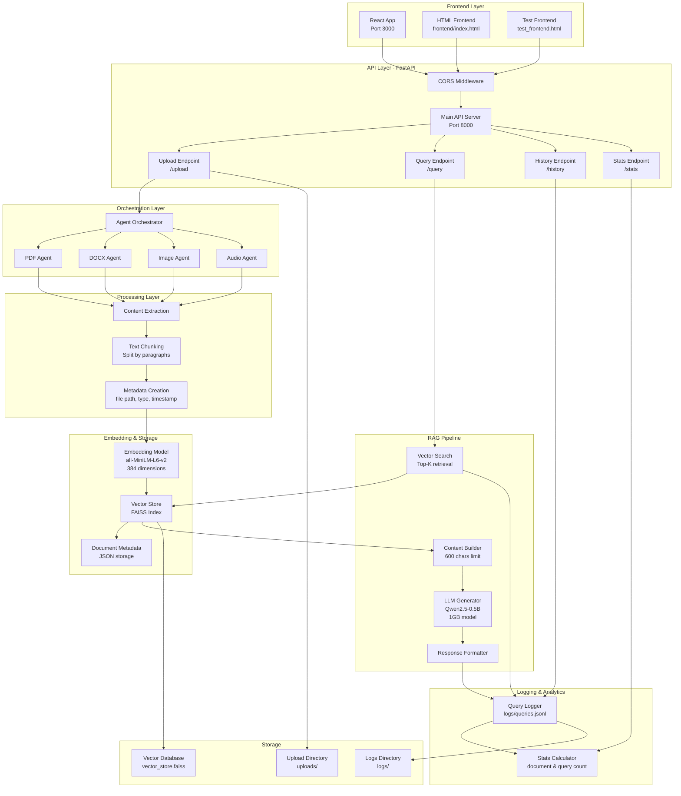
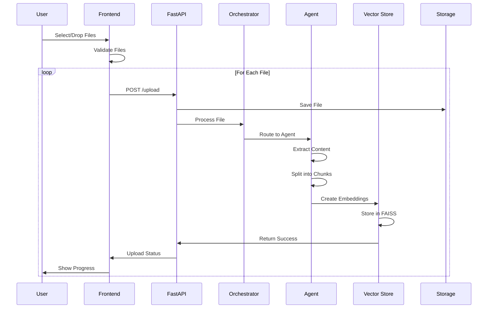
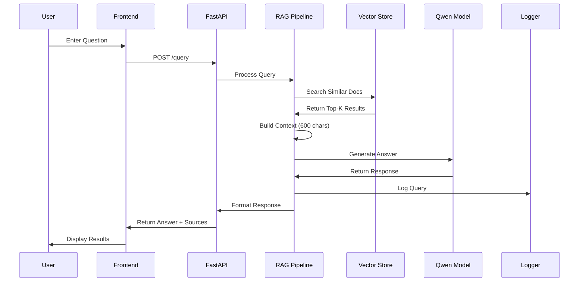
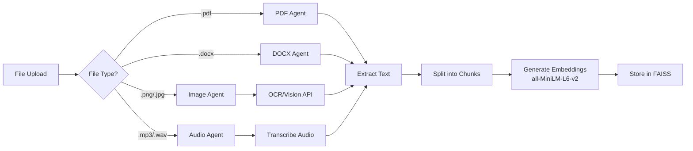
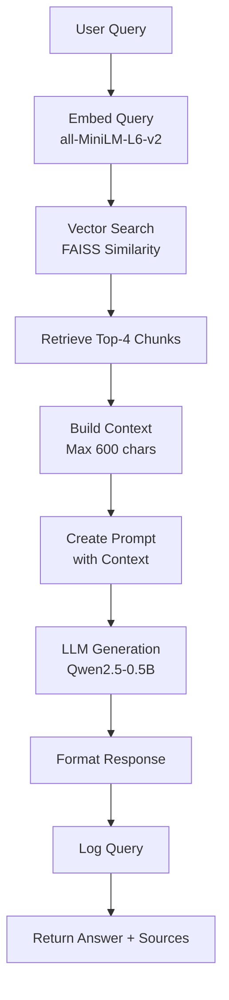
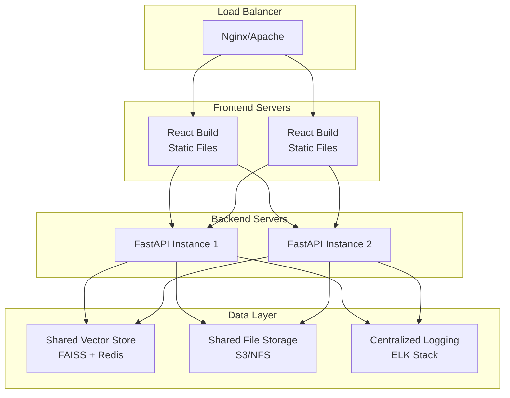
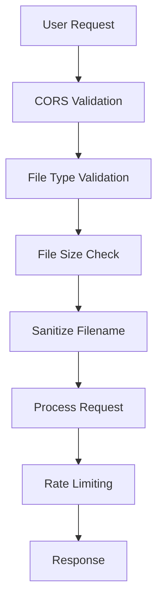
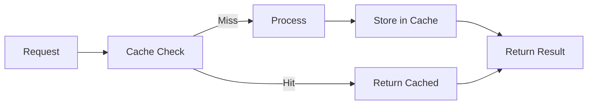

# Multi-modal LLM RAG System - Architecture Documentation

## 🏗️ Complete System Architecture



---

## 📊 Data Flow Diagrams

### 1. Document Upload Flow



### 2. Query Processing Flow



---

## 🔧 Component Architecture

### Backend Components

```
backend/
├── main.py                    # FastAPI Application
│   ├── CORS Configuration
│   ├── API Endpoints
│   └── Error Handling
│
├── config.py                  # Configuration Management
│   ├── Model Paths
│   ├── API Settings (Port 8000)
│   └── Directory Paths
│
├── agents/
│   ├── orchestrator.py       # File Router
│   ├── pdf_agent.py          # PDF Processing
│   ├── docx_agent.py         # DOCX Processing
│   ├── image_agent.py        # Image OCR/Description
│   └── audio_agent.py        # Audio Transcription
│
└── utils/
    ├── rag_pipeline.py       # RAG Query Engine
    ├── vector_store.py       # FAISS Wrapper
    └── logger.py             # Query Logging
```

### Frontend Components

```
frontend-react/
└── src/
    ├── App.js                # Main Component
    │   ├── State Management
    │   ├── API Integration
    │   ├── File Upload Handler
    │   ├── Query Handler
    │   └── UI Rendering
    │
    └── App.css               # Styling
        ├── Upload Zone
        ├── Progress Tracking
        ├── Stats Display
        └── History View
```

---

## 🔄 Processing Pipeline Architecture

### Multi-modal File Processing



### RAG Query Pipeline



---

## 🗄️ Data Storage Architecture

### Vector Database Structure

```
FAISS Index
├── Embeddings (384-dim vectors)
├── Document IDs
└── Metadata
    ├── file_path
    ├── type (pdf/docx/image/audio)
    ├── chunk_id
    └── timestamp
```

### File System Structure

```
Multi-modal-LLM/
├── uploads/              # Uploaded files
│   ├── document1.pdf
│   ├── document2.docx
│   ├── image1.png
│   └── audio1.mp3
│
├── logs/                 # Query logs
│   └── queries.jsonl
│
└── vector_store.faiss    # FAISS index
```

---

## 🌐 API Architecture

### Endpoints Overview

| Endpoint | Method | Purpose | Request | Response |
|----------|--------|---------|---------|----------|
| `/` | GET | Health Check | None | Status info |
| `/upload` | POST | Upload file | multipart/form-data | Upload status |
| `/query` | POST | Ask question | JSON with question | Answer + sources |
| `/history` | GET | Get query history | None | List of queries |
| `/stats` | GET | Get statistics | None | Doc/query counts |

### Request/Response Models

```python
# Upload Response
{
    "status": "success",
    "filename": "document.pdf",
    "type": "pdf",
    "chunks_created": 15,
    "message": "✅ Successfully processed"
}

# Query Request
{
    "question": "What is ...?",
    "top_k": 4
}

# Query Response
{
    "question": "What is ...?",
    "answer": "According to the documents...",
    "sources": [
        {
            "content": "...",
            "metadata": {...},
            "score": 0.85
        }
    ],
    "processing_time": 2.5
}

# Stats Response
{
    "total_documents": 10,
    "total_queries": 25,
    "last_updated": "2025-12-19T..."
}

# History Response
{
    "history": [
        {
            "question": "...",
            "answer": "...",
            "timestamp": "..."
        }
    ],
    "total": 25
}
```

---

## 🚀 Deployment Architecture

### Local Development Setup

```
Port 8000  ←→  Backend (FastAPI + Uvicorn)
Port 3000  ←→  React Development Server
```

### Production Architecture (Recommended)



---

## 🔐 Security Architecture



### Security Features

1. **CORS Configuration**: Allow specific origins only
2. **File Validation**: Accept only PDF, DOCX, Images, Audio
3. **File Size Limits**: Prevent DoS attacks
4. **Filename Sanitization**: Prevent path traversal
5. **Input Validation**: Validate all user inputs
6. **Error Handling**: No sensitive data in errors

---

## ⚡ Performance Architecture

### Optimization Strategies



### Current Optimizations

| Component | Optimization | Benefit |
|-----------|--------------|---------|
| Model | Qwen2.5-0.5B (1GB) | Fast CPU inference |
| Embeddings | all-MiniLM-L6-v2 | Lightweight, 384-dim |
| Context | 600 char limit | Faster generation |
| Top-K | 4 sources | Balanced accuracy/speed |
| Max Tokens | 200 | Quick responses |
| Temperature | 0.7 | Good quality |
| Decoding | Greedy (do_sample=False) | Deterministic |

---

## 📈 Monitoring Architecture

### Metrics Tracked

1. **Upload Metrics**
   - Files uploaded per type
   - Chunks created per file
   - Processing time per file
   - Success/failure rates

2. **Query Metrics**
   - Queries per minute
   - Average response time
   - Vector search time
   - LLM generation time
   - Cache hit rate

3. **System Metrics**
   - CPU usage
   - Memory usage
   - Disk space
   - API response time

### Logging Structure

```json
// Query Log Entry
{
    "timestamp": "2025-12-19T10:30:00",
    "question": "What is...?",
    "answer": "According to...",
    "sources_count": 4,
    "processing_time": 2.5,
    "success": true
}
```

---

## 🧩 Technology Stack

### Backend Stack
- **Framework**: FastAPI 0.100+
- **Server**: Uvicorn
- **LLM**: Qwen2.5-0.5B-Instruct (1GB)
- **Embeddings**: all-MiniLM-L6-v2 (sentence-transformers)
- **Vector DB**: FAISS
- **File Processing**: PyPDF2, python-docx, PIL, speech_recognition
- **ML Libraries**: transformers, torch

### Frontend Stack
- **Framework**: React 18.2.0
- **Build Tool**: react-scripts 5.0.1
- **Styling**: CSS3 with animations
- **HTTP Client**: Fetch API with CORS

### Infrastructure
- **Python**: 3.8+
- **Node.js**: 16+ (for React)
- **OS**: Cross-platform (Windows/Linux/Mac)

---

## 🔮 Extension Points

### Future Architecture Enhancements

1. **Caching Layer**
   ```
   Redis Cache → Reduce duplicate queries
   ```

2. **Authentication**
   ```
   JWT Tokens → Secure API access
   ```

3. **Database Layer**
   ```
   PostgreSQL → Store user data, documents metadata
   ```

4. **Message Queue**
   ```
   RabbitMQ/Celery → Async file processing
   ```

5. **Microservices**
   ```
   Separate services for:
   - File processing
   - Vector search
   - LLM inference
   ```

6. **API Gateway**
   ```
   Kong/AWS API Gateway → Centralized routing, auth, rate limiting
   ```

---

## 📝 Configuration Architecture

### Environment Variables

```bash
# API Settings
API_HOST=0.0.0.0
API_PORT=8000

# Model Configuration
MODEL_PATH=Qwen/Qwen2.5-0.5B-Instruct
EMBEDDING_MODEL=sentence-transformers/all-MiniLM-L6-v2

# Generation Parameters
MAX_TOKENS=200
TEMPERATURE=0.7
TOP_K_SOURCES=4
MAX_CONTEXT_LENGTH=600

# Storage Paths
UPLOAD_DIR=./uploads
VECTOR_DB_PATH=./vector_store.faiss
LOGS_DIR=./logs
```

---

## 🎯 Summary

This architecture provides:
- ✅ **Scalable**: Easy to add new agents/features
- ✅ **Modular**: Clear separation of concerns
- ✅ **Performant**: Optimized for CPU inference
- ✅ **Maintainable**: Well-organized codebase
- ✅ **Extensible**: Multiple extension points
- ✅ **User-friendly**: Multiple frontend options
- ✅ **Production-ready**: Proper logging, error handling, CORS

Use this as a reference to create specific diagrams for:
- Deployment diagrams
- Component diagrams
- Sequence diagrams
- Class diagrams
- Database schemas
- Network architecture
