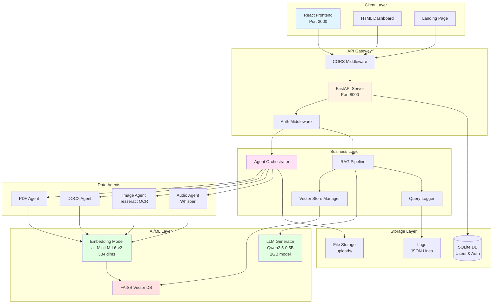
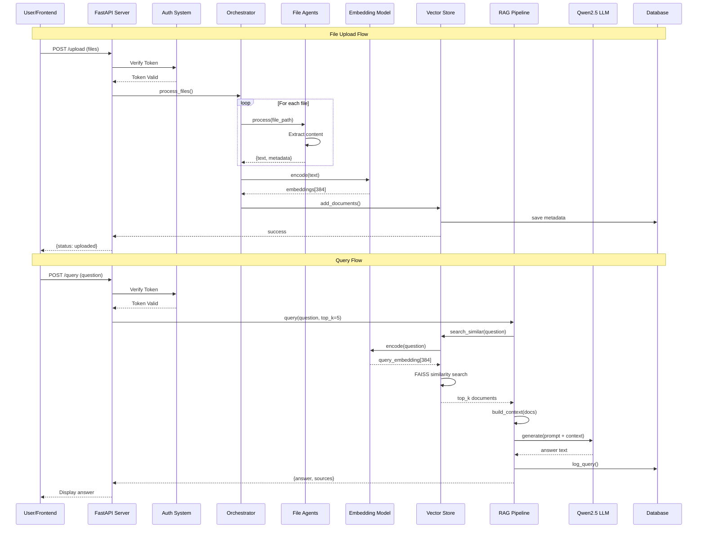
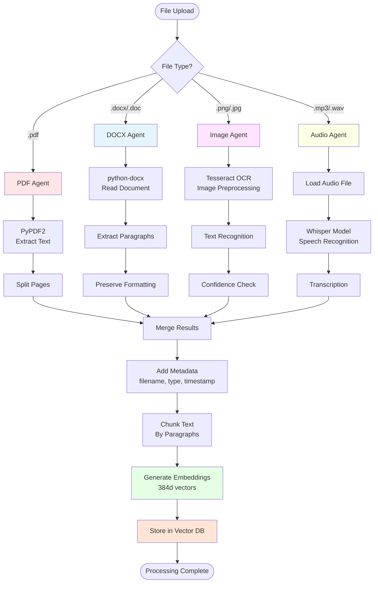
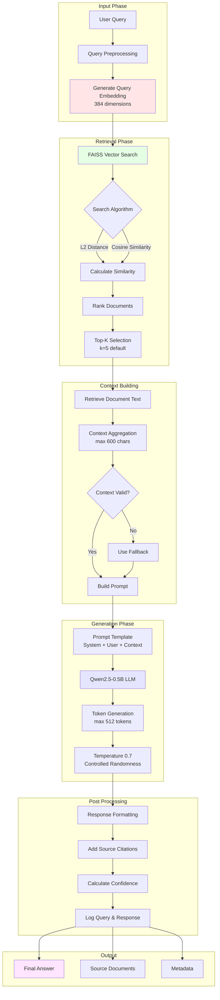
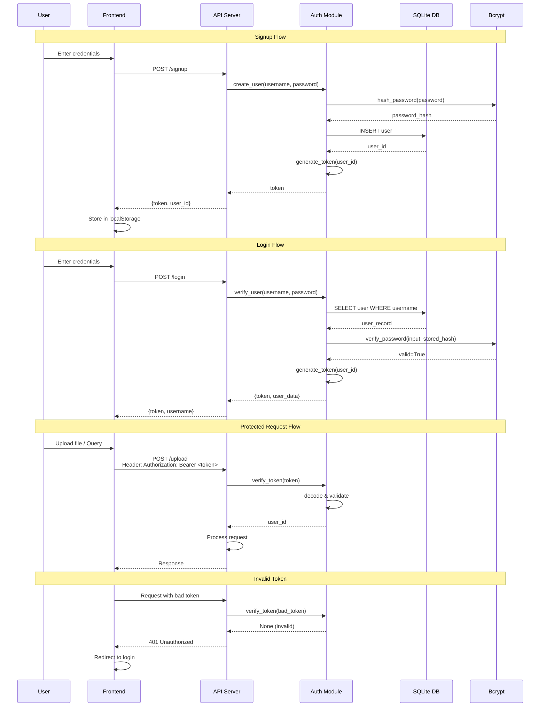
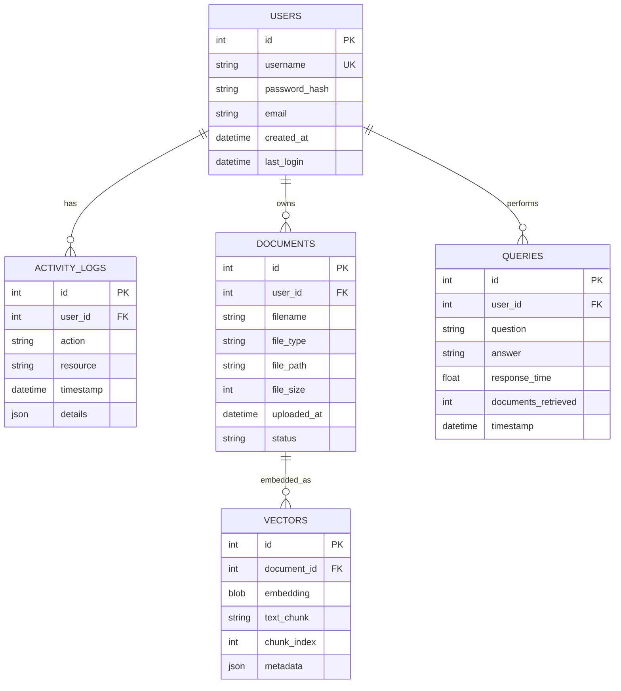
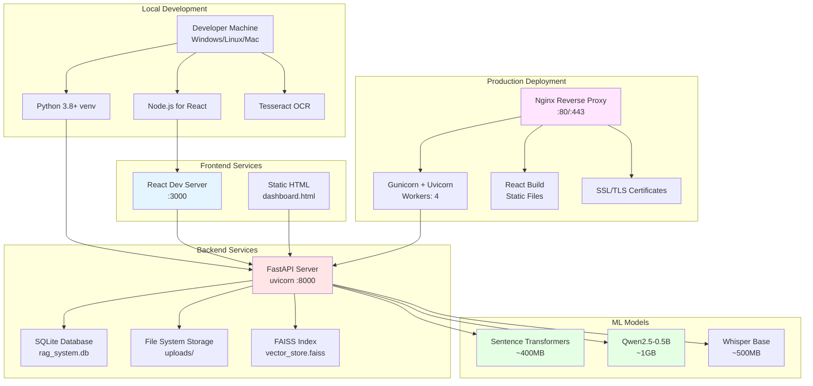
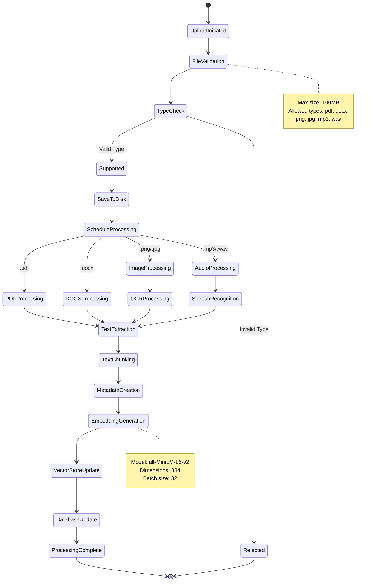
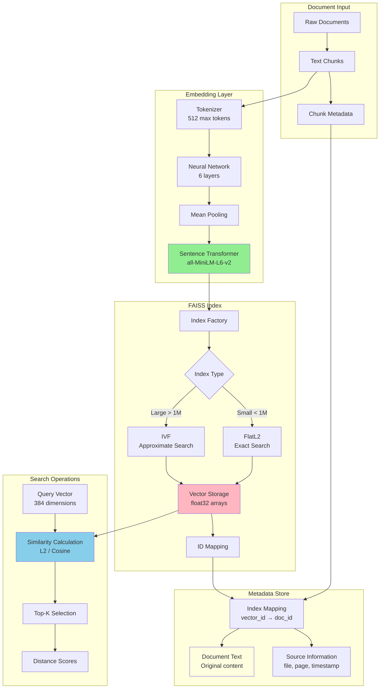

# Multi-modal LLM RAG System - Architecture Diagrams

## 📋 Table of Contents
1. [System Overview Architecture](#1-system-overview-architecture)
2. [Component Interaction Diagram](#2-component-interaction-diagram)
3. [Data Flow Diagram](#3-data-flow-diagram)
4. [Agent Processing Pipeline](#4-agent-processing-pipeline)
5. [RAG Pipeline Architecture](#5-rag-pipeline-architecture)
6. [Authentication & Security Flow](#6-authentication--security-flow)
7. [Database Schema](#7-database-schema)
8. [Deployment Architecture](#8-deployment-architecture)
9. [File Processing Workflow](#9-file-processing-workflow)
10. [Vector Store Architecture](#10-vector-store-architecture)

---

## 1. System Overview Architecture

---

## 2. Component Interaction Diagram

---

## 3. Data Flow Diagram

```mermaid
flowchart LR
    subgraph Input
        A1[PDF Files]
        A2[DOCX Files]
        A3[Images]
        A4[Audio Files]
    end
    
    subgraph Extraction
        B1[PyPDF2<br/>Text Extraction]
        B2[python-docx<br/>Text Extraction]
        B3[Tesseract OCR<br/>Image to Text]
        B4[Whisper<br/>Speech to Text]
    end
    
    subgraph Preprocessing
        C1[Text Chunking<br/>Paragraph Split]
        C2[Metadata Creation<br/>file, type, timestamp]
        C3[Text Normalization]
    end
    
    subgraph Embedding
        D1[Sentence Transformer<br/>all-MiniLM-L6-v2]
        D2[Vector Conversion<br/>384 dimensions]
    end
    
    subgraph Storage
        E1[FAISS Index<br/>Similarity Search]
        E2[Document Store<br/>Original Text]
        E3[Metadata Store<br/>JSON]
    end
    
    subgraph Query
        F1[User Question]
        F2[Question Embedding]
        F3[Vector Search<br/>Cosine Similarity]
        F4[Top-K Retrieval]
    end
    
    subgraph Generation
        G1[Context Builder<br/>600 char limit]
        G2[Prompt Template]
        G3[Qwen2.5-0.5B LLM]
        G4[Response Formatting]
    end
    
    subgraph Output
        H1[Answer Text]
        H2[Source Citations]
        H3[Confidence Score]
    end
    
    A1 --> B1
    A2 --> B2
    A3 --> B3
    A4 --> B4
    
    B1 --> C1
    B2 --> C1
    B3 --> C1
    B4 --> C1
    
    C1 --> C2
    C2 --> C3
    C3 --> D1
    D1 --> D2
    D2 --> E1
    D2 --> E2
    C2 --> E3
    
    F1 --> F2
    F2 --> F3
    E1 --> F3
    F3 --> F4
    
    F4 --> G1
    E2 --> G1
    G1 --> G2
    G2 --> G3
    G3 --> G4
    
    G4 --> H1
    E3 --> H2
    F4 --> H3
    
    style D1 fill:#90EE90
    style E1 fill:#FFB6C1
    style G3 fill:#87CEEB
```

---

## 4. Agent Processing Pipeline

---

## 5. RAG Pipeline Architecture

---

## 6. Authentication & Security Flow

---

## 7. Database Schema

---

## 8. Deployment Architecture

---

## 9. File Processing Workflow

---

## 10. Vector Store Architecture

---

## 📊 Diagram Legend

### Colors & Shapes
- **Blue boxes**: Frontend components
- **Yellow boxes**: API/Backend services
- **Pink boxes**: Processing logic
- **Green boxes**: AI/ML models
- **Red boxes**: Storage systems
- **Diamonds**: Decision points
- **Circles**: Start/End states

### Arrow Types
- **Solid arrows**: Data flow
- **Dashed arrows**: Control flow
- **Thick arrows**: Primary path
- **Thin arrows**: Secondary path

---

## 🔧 How to Use These Diagrams

### For Developers
1. Start with **System Overview** for high-level understanding
2. Use **Component Interaction** for API integration
3. Reference **Data Flow** for debugging pipelines
4. Check **Agent Processing** for file handling logic

### For System Architects
1. Review **Deployment Architecture** for infrastructure planning
2. Study **Database Schema** for data modeling
3. Examine **Vector Store Architecture** for scalability
4. Analyze **RAG Pipeline** for optimization opportunities

### For Stakeholders
1. Begin with **System Overview** for business understanding
2. Review **Authentication Flow** for security posture
3. Check **File Processing Workflow** for feature capabilities
4. Use **Deployment Architecture** for cost estimation

---

## 📝 Diagram Maintenance

**Last Updated**: January 19, 2026
**Diagram Format**: Mermaid.js (Markdown-compatible)
**Rendering**: GitHub, GitLab, VS Code (with plugins)

**To update diagrams**:
1. Edit the Mermaid syntax in this file
2. Test rendering using [Mermaid Live Editor](https://mermaid.live/)
3. Update the "Last Updated" date
4. Commit changes with descriptive message

---

## 🌐 External Resources

- [Mermaid Documentation](https://mermaid.js.org/)
- [FAISS Documentation](https://faiss.ai/)
- [FastAPI Documentation](https://fastapi.tiangolo.com/)
- [Sentence Transformers](https://www.sbert.net/)
